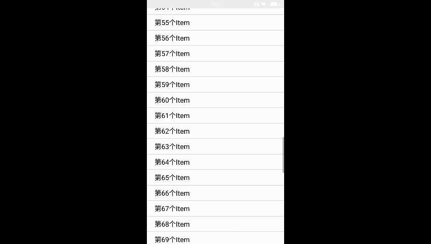

# CircularFloatingMenu


An animated circular floating menu for Android, inspired by Path app.

### Demo
 demo:<br/>
 


## Getting Started
### Requirements
- API >= 11

### Usage
CircularFloatingMenu can be attached to **any view** in your layout. CircularFloatingMenu is extends RelativeLayout. 

```java
// CircularFloatingMenu attrs
<declare-styleable name="CircularFloatingMenu">
        <attr name="radius" format="reference|dimension"/>
        <attr name="degrees" format="reference|integer"/>
        <attr name="startDegrees" format="reference|integer"/>
        <attr name="isCloseWhenItemClick" format="boolean"/>
    </declare-styleable>
	
```


```java
//in layout xml
 <com.tealer.views.CircularFloatingMenu
        android:id="@+id/cfm_action_view"
        android:layout_gravity="bottom|center_horizontal"
        android:layout_width="fill_parent"
        android:layout_height="fill_parent">
        <ImageView
            android:layout_width="fill_parent"
            android:layout_height="fill_parent"
            android:background="@color/triphare_transparent_black"/>
        <ImageView
            style="@style/bottom_center_item"
            android:src="@drawable/cfm_invite"/>
        <ImageView
            style="@style/bottom_center_item"
            android:src="@drawable/cfm_state"/>
        <ImageView
            style="@style/bottom_center_item"
            android:src="@drawable/cfm_signin"/>
        <FrameLayout
            style="@style/bottom_center_menu"
            >
            <ImageView
                android:layout_width="wrap_content"
                android:layout_height="wrap_content"
                android:scaleType="centerCrop"
                android:src="@drawable/cfm_minus"/>
            <ImageView
                android:layout_width="wrap_content"
                android:layout_height="wrap_content"
                android:scaleType="centerCrop"
                android:src="@drawable/cfm_vertical_bar"/>
        </FrameLayout>
    </com.tealer.views.CircularFloatingMenu>
	
// bottom_center_item style xml
<style name="bottom_center_item">
        <item name="android:layout_width">73.3dp</item>
        <item name="android:layout_height">73.3dp</item>
        <item name="android:layout_margin">7dp</item>
        <item name="android:gravity">center</item>
        <item name="android:scaleType">centerCrop</item>
        <item name="android:layout_alignParentBottom">true</item>
        <item name="android:layout_centerHorizontal">true</item>
    </style>
    // bottom_center_menu style xml
    <style name="bottom_center_menu">
        <item name="android:layout_width">54dp</item>
        <item name="android:layout_height">54dp</item>
        <item name="android:layout_margin">7dp</item>
        <item name="android:gravity">center</item>
        <item name="android:textSize">12sp</item>
        <item name="android:layout_alignParentBottom">true</item>
        <item name="android:layout_centerHorizontal">true</item>
    </style>
```

2 - Activity:

```java
 circularFloatingMenu.setOnItemClickListener(new CircularFloatingMenu.OnItemClickListener() {
            @Override
            public void onItemClick(View view, int index) {
                switch (index){
                    case 1:
                        Toast.makeText(MainActivity.this,"第一项被点击",Toast.LENGTH_SHORT).show();
                        break;
                    case 2:
                        Toast.makeText(MainActivity.this,"第二项被点击",Toast.LENGTH_SHORT).show();
                        break;
                    case 3:
                        Toast.makeText(MainActivity.this,"第三项被点击",Toast.LENGTH_SHORT).show();
                        break;
                }
            }
        });
 
```
And you're ready to go!


